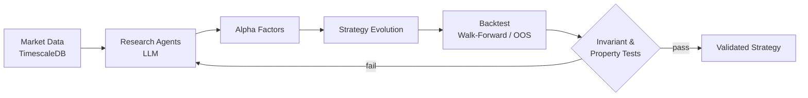

### Quantitative Developer — AI-driven trading systems

Building autonomous research and trading agents · Security researcher on the side 
Advocate for decentralized, self-custodial and private systems

---

## 🧬 NexQuant — Autonomous Multi-Agent Quant Research

> [!NOTE]
> Strategies are judged out-of-sample with cost & slippage modelling — not by in-sample fit.

<b>What it does</b>

- Discovers and generates alpha factors with LLM-driven research agents
- Evolves and backtests strategies continuously
- Integrates time-series foundation models (e.g. Kronos) alongside classical factor models
- Verifies results with mathematical invariants and property-based testing

**Infra:** Redis · PostgreSQL/TimescaleDB · QLib · llama.cpp

---

## ₿ Principles

> [!IMPORTANT]
> **Don't trust, verify.** I build for and support decentralized, permissionless and private systems —
> Bitcoin, self-custody, self-hosted infrastructure, end-to-end encryption.

---

## 🔍 Security Research

| | |
|---|---|
| 🏆 | Listed in the [Proton Security Contributors](https://proton.me/blog/protonmail-security-contributors) (*Nicolas Bohn*, 2026) |
| 🌐 | Bug bounty research on on-chain & exchange infrastructure — API, auth, protocol integrity |

---

## 🛠️ Stack

| Quant & AI | Data & Infra | Exploring |
|---|---|---|
| <kbd>Python</kbd> <kbd>QLib</kbd> <kbd>llama.cpp</kbd> <kbd>Multi-Agent</kbd> | <kbd>PostgreSQL</kbd> <kbd>TimescaleDB</kbd> <kbd>Redis</kbd> <kbd>Docker</kbd> <kbd>Linux</kbd> | <kbd>Rust</kbd> |

---

